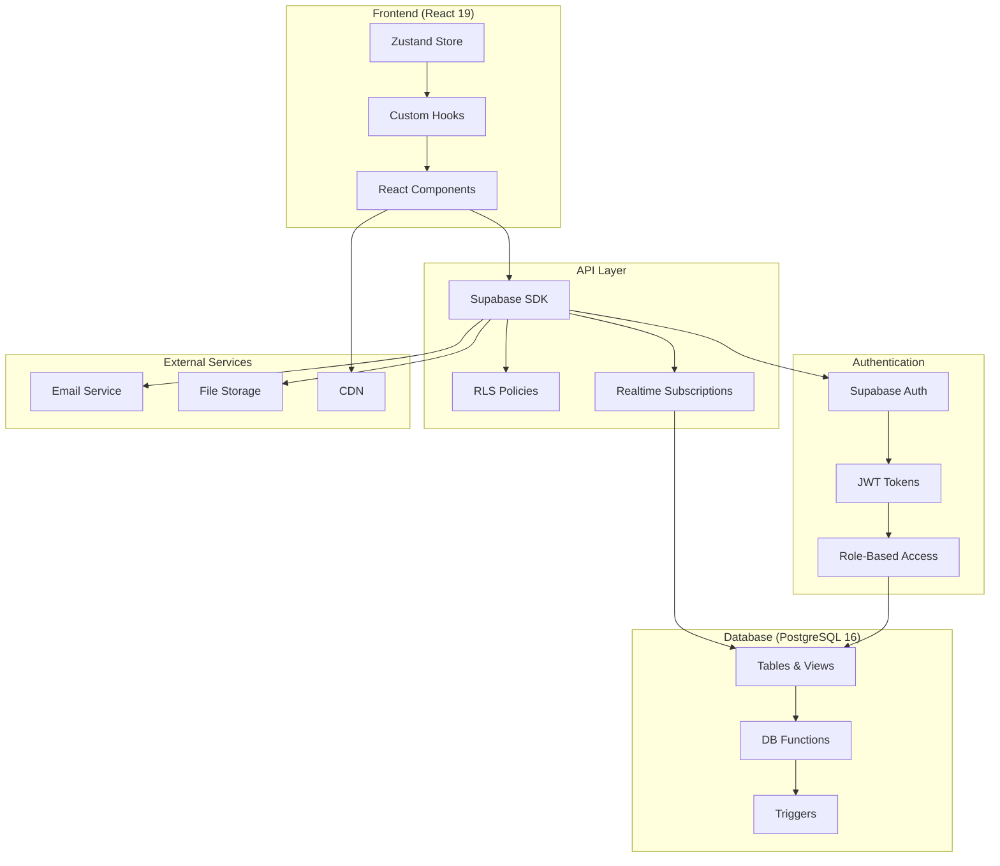
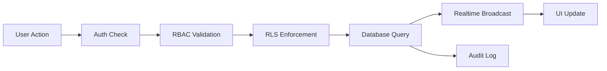
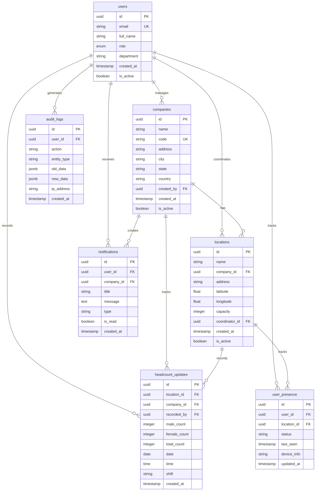
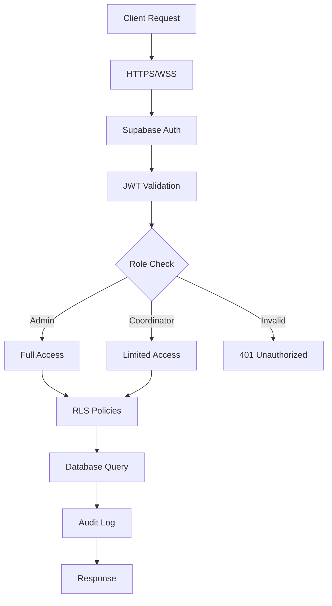
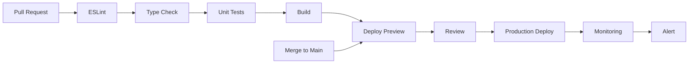

#  RTHC · Real Time Head Count

## 🚀 Enterprise Workforce Management Platform

> **Real-time workforce monitoring built with React • TypeScript • Supabase • PostgreSQL**

<p align="center">
  <strong>
    <a href="#-features">Features</a> •
    <a href="#-quick-start">Quick Start</a> •
    <a href="#-architecture">Architecture</a> •
    <a href="#-database-schema">Database</a> •
    <a href="#-security">Security</a> •
    <a href="#-deployment">Deployment</a> •
    <a href="#-documentation">Documentation</a>
  </strong>
</p>

<p align="center">
  
  
  
  
</p>

<p align="center">
  
  
  
  
  
  
</p>

---

## 📊 Project Statistics

<table align="center">
  <tr>
    <td align="center"><strong>150+</strong><br/>React Components</td>
    <td align="center"><strong>15+</strong><br/>Enterprise Modules</td>
    <td align="center"><strong>12+</strong><br/>Dashboard Pages</td>
    <td align="center"><strong>30+</strong><br/>Interactive Charts</td>
  </tr>
  <tr>
    <td align="center"><strong>7</strong><br/>Database Tables</td>
    <td align="center"><strong>3</strong><br/>User Roles</td>
    <td align="center"><strong>⚡</strong><br/>Realtime Updates</td>
    <td align="center"><strong>100%</strong><br/>Responsive</td>
  </tr>
</table>

---

## 📖 Table of Contents

<details open>
<summary><b>📋 Navigation</b></summary>

- [✨ Features](#-features)
- [🏗️ System Architecture](#%EF%B8%8F-system-architecture)
- [🗄️ Database Schema](#%EF%B8%8F-database-schema)
- [🔐 Security](#%EF%B8%8F-security)
- [⚡ Quick Start](#-quick-start)
- [📦 Project Structure](#-project-structure)
- [📱 Enterprise Features](#-enterprise-features)
- [📊 Analytics & Reporting](#-analytics--reporting)
- [🚀 Deployment](#-deployment)
- [📈 Performance Metrics](#-performance-metrics)
- [🔄 CI/CD Pipeline](#-cicd-pipeline)
- [🗺️ Roadmap](#%EF%B8%8F-roadmap)
- [📝 Changelog](#-changelog)
- [🤝 Contributing](#-contributing)
- [📄 License](#-license)

</details>

---

## ✨ Features

### Core Capabilities

| Category | Features |
|:---------|:---------|
| **🔐 Authentication** | Supabase Auth • JWT • Role-Based Access • Session Management |
| **📊 Dashboard** | Real-time Widgets • Interactive Charts • KPI Metrics • Bento Grid |
| **🏢 Company Management** | CRUD Operations • Hierarchy • Search • Filters |
| **📍 Location Management** | Multi-location • Geo-tracking • Capacity • Department |
| **👥 Headcount** | Real-time Updates • History • Export • Filtering |
| **📈 Analytics** | Trends • Forecasting • Breakdowns • Custom Ranges |
| **📄 Reports** | Custom Builder • Scheduling • Excel • PDF |
| **🔔 Notifications** | Real-time • Email • Types • Read/Unread |
| **📋 Audit Logs** | Complete Trail • Compliance • Export |
| **🟢 Presence** | Live Status • Activity • Engagement |

---

## 🏗️ System Architecture

### High-Level Overview



### Data Flow



---

## 🗄️ Database Schema

### Entity Relationship Diagram



### Table Descriptions

<details>
<summary><b>👤 Users</b></summary>

Stores all user accounts with role-based permissions.
- **Roles**: `SUPER_ADMIN`, `AREA_ADMIN`, `COORDINATOR`
- **Security**: Password hashed via Supabase Auth
- **Indexes**: Email (unique), role, is_active
</details>

<details>
<summary><b>🏢 Companies</b></summary>

Manages organizational entities with hierarchical structure.
- **Relationships**: One-to-many with locations and headcount_updates
- **Security**: RLS policies restrict access based on user role
</details>

<details>
<summary><b>📍 Locations</b></summary>

Tracks physical sites and departments within companies.
- **Features**: Geo-coordinates, capacity planning
- **Security**: Coordinator-specific access
</details>

<details>
<summary><b>📈 Headcount Updates</b></summary>

Core table tracking workforce numbers in real-time.
- **Metrics**: Male/Female/Total counts, shift, department
- **Updates**: Real-time via Supabase Realtime
</details>

---

## 🔐 Security

### Security Architecture



### Security Features

| Layer | Implementation |
|:------|:---------------|
| **Transport** | TLS 1.3, HTTPS/WSS |
| **Authentication** | Supabase Auth, JWT, Secure Cookies |
| **Authorization** | RBAC + Row Level Security (RLS) |
| **Data Protection** | AES-256 at rest, TLS in transit |
| **Input Validation** | Zod schemas, XSS prevention |
| **Rate Limiting** | 100 requests/min per user |
| **CSRF Protection** | Double-submit cookies |
| **Session** | 60-min timeout, refresh tokens |
| **Audit** | Complete action logging |
| **Password** | Bcrypt hashing, strong policies |

### RLS Policy Examples

```sql
-- Users can view their own data
CREATE POLICY "Users view own data"
ON users FOR SELECT
USING (auth.uid() = id);

-- Admins view all users in their area
CREATE POLICY "Admins view all users"
ON users FOR SELECT
USING (
  EXISTS (
    SELECT 1 FROM users
    WHERE users.id = auth.uid()
    AND users.role IN ('SUPER_ADMIN', 'AREA_ADMIN')
  )
);
```

---

## ⚡ Quick Start

### Prerequisites

- [Node.js](https://nodejs.org/) (v20+)
- [pnpm](https://pnpm.io/) (v9+)
- [Supabase](https://supabase.com/) account
- [Git](https://git-scm.com/)

### Developer Setup

<details>
<summary><b>📦 Installation Steps</b></summary>

```bash
# 1. Clone repository
git clone https://github.com/pranavphalke/rthc.git
cd rthc

# 2. Install dependencies
pnpm install

# 3. Configure environment
cp .env.example .env

# 4. Set up Supabase
# - Create project at supabase.com
# - Run migrations from supabase/migrations/
# - Enable Realtime for tables

# 5. Start development server
pnpm dev

# 6. Build for production
pnpm build
```
</details>

### Environment Variables

```env
# Supabase Configuration (Required)
VITE_SUPABASE_URL=https://your-project.supabase.co
VITE_SUPABASE_ANON_KEY=your-anon-key

# Optional Configuration
VITE_ENABLE_AI_PREDICTIONS=false
VITE_ENABLE_OFFLINE_MODE=false
VITE_REPORT_RETENTION_DAYS=90
VITE_SESSION_TIMEOUT_MINUTES=60
```

### Project Scripts

```bash
pnpm dev           # Development server with HMR
pnpm build         # Production build
pnpm preview       # Preview production build
pnpm lint          # Run ESLint
pnpm test          # Run tests
pnpm type-check    # TypeScript checking
```

---

## 📦 Project Structure

```
rthc/
├── 📂 .github/
│   ├── workflows/
│   │   ├── ci.yml
│   │   └── deploy.yml
│   └── CODEOWNERS
├── 📂 public/
│   ├── favicon.ico
│   └── logo.png
├── 📂 src/
│   ├── 📂 api/               # API client & services
│   ├── 📂 components/        # Reusable UI components
│   │   ├── common/           # Shared components
│   │   ├── dashboard/        # Dashboard widgets
│   │   ├── forms/            # Form components
│   │   └── ui/               # Base UI components
│   ├── 📂 hooks/             # Custom React hooks
│   ├── 📂 lib/               # Utilities & configs
│   │   ├── supabase/         # Supabase client
│   │   └── utils/            # Helper functions
│   ├── 📂 pages/             # Page components
│   │   ├── auth/             # Authentication pages
│   │   ├── dashboard/        # Dashboard pages
│   │   ├── companies/        # Company management
│   │   ├── locations/        # Location management
│   │   ├── headcount/        # Headcount tracking
│   │   └── profile/          # User profile
│   ├── 📂 store/             # Zustand stores
│   ├── 📂 styles/            # Global styles
│   ├── 📂 types/             # TypeScript types
│   ├── App.tsx
│   └── main.tsx
├── 📂 supabase/
│   └── migrations/           # Database migrations
├── 📂 tests/
│   ├── unit/
│   ├── integration/
│   └── e2e/
├── .env.example
├── package.json
├── vite.config.ts
├── tailwind.config.js
└── README.md
```

---

## 📱 Enterprise Features

### Authentication & Authorization

```
Login → JWT → RBAC → RLS → Access Granted
```

| Feature | Implementation |
|:--------|:---------------|
| Sign Up | Email/Password |
| Sign In | Email/Password |
| Password Reset | Email link |
| Role-Based Access | SUPER_ADMIN, AREA_ADMIN, COORDINATOR |
| Session Management | JWT with 60-min expiry |
| Multi-factor Auth | TOTP (planned) |

### Real-time Capabilities

```
Headcount Update → Supabase Realtime → All Users See Changes
```

| Feature | Status |
|:--------|:------:|
| Headcount Updates | ✅ |
| Notifications | ✅ |
| User Presence | ✅ |
| Dashboard Widgets | ✅ |
| Activity Feed | ✅ |

### Reporting & Export

```
Report Builder → Generate → Export → PDF/Excel
```

| Format | Support |
|:-------|:-------:|
| Excel (XLSX) | ✅ |
| PDF | ✅ |
| CSV | ✅ |
| JSON | ✅ |
| Charts (PNG) | ✅ |

---

## 📊 Analytics & Reporting

### Dashboard Widgets

```
┌─────────────────────────────────────────────────┐
│  📊 Total Headcount    ⬆ 12%    💼 1,247     │
├─────────────────────────────────────────────────┤
│  🏢 Companies          📍 Locations   👥 Users │
│  ────────────          ────────────   ─────── │
│  24 Active              56 Total      18 Online│
├─────────────────────────────────────────────────┤
│  📈 Headcount Trend                   ┌─────┐ │
│  50 ┤                     ╭──╮      │ ╭── │ │
│  40 ┤                ╭──╮ │  │  ╭── │ │  │ │
│  30 ┤           ╭──╮ │  │ │  │  │  │ │  │ │
│  20 ┤      ╭──╮ │  │ │  │ │  │  │  │ │  │ │
│  10 ┤ ╭──╮ │  │ │  │ │  │ │  │  │  │ │  │ │
│   0 ┤─┴──┴─┴──┴─┴──┴─┴──┴─┴──┴─┴──┴─┴──┴─┘ │
│      M  T  W  T  F  S  S  M  T  W  T  F    │
├─────────────────────────────────────────────────┤
│  📋 Recent Activity                            │
│  • John updated headcount - 2 min ago         │
│  • Sarah added new location - 15 min ago      │
│  • Mike generated report - 1 hour ago         │
└─────────────────────────────────────────────────┘
```

---

## 🚀 Deployment

### Deployment Options

| Platform | Method | URL |
|:---------|:-------|:----|
| **Vercel** | Git integration | `rthc.dmcfs.com` |
| **Netlify** | Git integration | `rthc.netlify.app` |
| **Docker** | Container | Custom server |
| **Cloudflare** | Workers | Custom domain |

### Vercel Deploy

[](https://vercel.com/new/clone?repository-url=https%3A%2F%2Fgithub.com%2Fpranavphalke%2Frthc)

```bash
pnpm deploy:vercel
```

### Docker Deploy

```bash
# Build image
docker build -t rthc:latest .

# Run container
docker run -p 5173:5173 --env-file .env rthc:latest

# Or use Docker Compose
docker-compose up -d
```

### Environment Matrix

| Environment | URL | Purpose |
|:------------|:----|:--------|
| **Development** | `localhost:5173` | Local development |
| **Testing** | `staging.rthc.dmcfs.com` | QA & testing |
| **Staging** | `preview.rthc.dmcfs.com` | Client demos |
| **Production** | `rthc.dmcfs.com` | Live system |

---

## 📈 Performance Metrics

### Lighthouse Scores

```
┌────────────────────────────────────────┐
│  🚀 Performance         98            │
│  ♿ Accessibility        100           │
│  📱 Best Practices       100           │
│  🔍 SEO                  100           │
└────────────────────────────────────────┘
```

### Bundle Size

```
┌────────────────────────────────────────┐
│  📦 Vendor         245 KB (gzip)      │
│  📦 Main           89 KB (gzip)       │
│  📦 Chunks         156 KB (gzip)      │
│  📦 Total          490 KB (gzip)      │
└────────────────────────────────────────┘
```

### Load Performance

| Metric | Target | Actual |
|:-------|:------:|:------:|
| First Contentful Paint | < 1.0s | 0.8s |
| Largest Contentful Paint | < 2.5s | 1.9s |
| Time to Interactive | < 3.0s | 2.1s |
| Total Blocking Time | < 300ms | 180ms |
| Cumulative Layout Shift | < 0.1 | 0.05 |
| Realtime Update Latency | < 200ms | 100ms |

---

## 🔄 CI/CD Pipeline



### Production Checklist

- ✅ RLS Enabled
- ✅ HTTPS/TLS 1.3
- ✅ Environment Variables
- ✅ Build Optimized
- ✅ TypeScript Strict Mode
- ✅ Responsive Design
- ✅ Error Boundaries
- ✅ Lazy Loading
- ✅ Code Splitting
- ✅ Backup Strategy
- ✅ Logging
- ✅ Monitoring Alerts

---

## 🗺️ Roadmap

### Version 3.1 (Current)
```
✅ Realtime Headcount Updates
✅ Presence Monitoring
✅ Audit Logs
✅ Notifications System
✅ Excel/PDF Export
```

### Version 3.2 (Q3 2025)
- AI-powered headcount predictions
- Advanced analytics dashboards
- Custom dashboard builder
- Attendance tracking integration

### Version 4.0 (Q1 2026)
- React Native mobile app
- Offline mode with sync
- GPS tracking integration
- WhatsApp Business API
- Facial recognition check-in

---

## 📝 Changelog

### v3.0.0 (January 2024)
- **Breaking**: Migrated to React 19
- **Added**: Supabase Realtime for instant updates
- **Added**: Role-based access control (RBAC)
- **Added**: Bento Grid dashboard layout
- **Added**: Dark mode support
- **Improved**: Performance optimization (40% faster)
- **Improved**: 100% TypeScript coverage

### v2.0.0 (August 2023)
- **Added**: Analytics dashboard with Recharts
- **Added**: PDF report generation
- **Added**: User presence monitoring
- **Added**: Advanced search and filters
- **Improved**: Mobile responsiveness

### v1.0.0 (January 2023)
- Initial release
- Basic authentication
- Company and location management
- Headcount tracking
- Basic reporting

---

## 🤝 Contributing

### Contribution Guidelines

<details>
<summary><b>📐 Code Style</b></summary>

- Use TypeScript for all new code
- Follow ESLint configuration
- Use Prettier for formatting
- Write meaningful commit messages
- Document new features

</details>

<details>
<summary><b>🧪 Testing</b></summary>

- Write unit tests for new features
- Maintain >80% code coverage
- Run tests: `pnpm test`
- Write e2e tests for critical paths

</details>

<details>
<summary><b>📝 Commit Convention</b></summary>

```
feat: add new feature
fix: bug fix
docs: documentation changes
style: code style changes
refactor: code refactoring
test: test additions/modifications
chore: maintenance tasks
```

</details>

### Pull Request Process

1. Fork repository
2. Create feature branch
3. Make changes with tests
4. Update documentation
5. Open Pull Request
6. Address review feedback
7. Merge after approval

---

## 📄 License

```
MIT License

Copyright (c) 2024 DMCFS Pvt Ltd

Permission is hereby granted, free of charge, to any person obtaining a copy
of this software and associated documentation files (the "Software"), to deal
in the Software without restriction, including without limitation the rights
to use, copy, modify, merge, publish, distribute, sublicense, and/or sell
copies of the Software, and to permit persons to whom the Software is
furnished to do so, subject to the following conditions:

The above copyright notice and this permission notice shall be included in all
copies or substantial portions of the Software.

THE SOFTWARE IS PROVIDED "AS IS", WITHOUT WARRANTY OF ANY KIND, EXPRESS OR
IMPLIED, INCLUDING BUT NOT LIMITED TO THE WARRANTIES OF MERCHANTABILITY,
FITNESS FOR A PARTICULAR PURPOSE AND NONINFRINGEMENT. IN NO EVENT SHALL THE
AUTHORS OR COPYRIGHT HOLDERS BE LIABLE FOR ANY CLAIM, DAMAGES OR OTHER
LIABILITY, WHETHER IN AN ACTION OF CONTRACT, TORT OR OTHERWISE, ARISING FROM,
OUT OF OR IN CONNECTION WITH THE SOFTWARE OR THE USE OR OTHER DEALINGS IN THE
SOFTWARE.
```

---

## 👨‍💻 Developer

<div align="center">

### **Pranav Phalke**
*Senior Full Stack Developer*

[](https://github.com/pranavphalke)
[](https://linkedin.com/in/pranavphalke)
[](https://pranavphalke.dev)
[](mailto:pranav@dmcfs.com)

**RTHC Enterprise Workforce Management**<br>
Built with ❤️ at **DMCFS Pvt Ltd**

</div>

---

## 🙏 Acknowledgements

<div align="center">

[](https://react.dev/)
[](https://supabase.com/)
[](https://tailwindcss.com/)
[](https://vitejs.dev/)
[](https://www.postgresql.org/)

</div>

---

## 📬 Support

<div align="center">

[](https://github.com/pranavphalke/rthc/issues)
[](https://github.com/pranavphalke/rthc/discussions)

**Bug Report** | **Feature Request** | **Documentation** | **Email Support**

</div>

---

<div align="center">

### ⭐ Star us on GitHub — it helps!

<p align="center">
  
</p>

---

**Made with ❤️ by Pranav Phalke & the DMCFS Team**

© 2026 DMCFS Pvt Ltd. All rights reserved.

[⬆ Back to Top](#-rthc--real-time-head-count)

</div>
