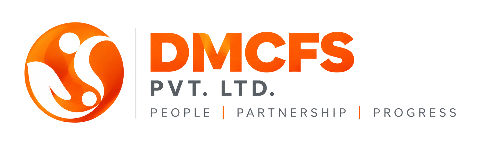

<div align="center">
  
  <h1>DMCFS Workforce Operations Suite</h1>
  <p><strong>One platform. Four applications. Complete workforce visibility.</strong></p>
  <p>
    An enterprise workforce management and analytics platform for tracking headcount,
    understanding client performance, assessing coordinator operations, and accessing
    an AI assistant.
  </p>
  <p>
    
    
    
    
  </p>
</div>

<p align="center">
  <a href="#applications">Applications</a> ·
  <a href="#platform-capabilities">Capabilities</a> ·
  <a href="#getting-started">Get started</a> ·
  <a href="#configuration">Configuration</a> ·
  <a href="#project-structure">Project structure</a>
</p>

---

## The platform at a glance

Sign in once and open the application for the work at hand. The role-aware application
selector brings four DMCFS tools together in one responsive React platform.

<table>
  <thead>
    <tr>
      <th align="left">Application</th>
      <th align="left">Purpose</th>
      <th align="left">Open from</th>
    </tr>
  </thead>
  <tbody>
    <tr>
      <td><strong>RTHC</strong><br />Real-Time Head Count</td>
      <td>Track workforce requirements, filled positions, vacancies, and coordinator updates across locations.</td>
      <td><code>/dashboard</code></td>
    </tr>
    <tr>
      <td><strong>RTCA</strong><br />Client &amp; Workforce Analytics</td>
      <td>Explore client, scheme, and location performance with workforce analytics and business trends.</td>
      <td><code>/rtca</code></td>
    </tr>
    <tr>
      <td><strong>RTCPM</strong><br />Coordinator Performance Management</td>
      <td>Manage and review coordinator assessments, performance measures, and assessment coverage.</td>
      <td><code>/rtcpm</code></td>
    </tr>
    <tr>
      <td><strong>DMCFS AI Assistant</strong><br />AI / Chat</td>
      <td>Ask questions with the configured OpenAI or Claude provider from a dedicated assistant.</td>
      <td><code>/ai-chat</code></td>
    </tr>
  </tbody>
</table>

## Applications

### RTHC · Real-Time Head Count

Keep workforce operations connected from company to location. RTHC brings headcount
visibility and operational management into a single workspace.

- View workforce requirements, filled headcount, vacancies, and dashboard KPIs.
- Manage companies, locations, and coordinator records.
- Enter and review headcount updates and historical reporting.
- Explore analytics and company-level reports.
- Give coordinators a dedicated headcount submission workflow.
- Review profile and application settings.

### RTCA · Client & Workforce Analytics

Turn workforce data into client and business insight with analytics designed for
company and location exploration.

- Analyze workforce requirements, filled roles, and vacancies.
- Break down results by company, location, shift, and scheme.
- Explore workforce and business-growth trends.
- Drill into client and location performance.
- Export supported analytics to CSV or Excel.

### RTCPM · Coordinator Performance Management

Support structured coordinator assessment and performance review.

- Create and review coordinator assessments.
- Track assessment status, period, and assessment coverage.
- Filter assessments by coordinator, company, location, period, and status.
- Review overall results and performance across assessment parameters.

### DMCFS AI Assistant · AI / Chat

Chat with the AI provider configured for your environment. Choose between OpenAI and
Claude in the assistant; provider credentials remain on the server rather than in
browser-exposed `VITE_` variables.

## Platform capabilities

- **Role-aware access:** protected screens and role guards control access to applications
  and operational workflows.
- **Workforce administration:** company, location, coordinator, and user-management
  screens support day-to-day operations.
- **Analytics and reporting:** dashboards, KPI views, workforce breakdowns, trends,
  reports, and supported spreadsheet exports.
- **Responsive interface:** React, Tailwind CSS, reusable UI components, and interactive
  charts.
- **Light and dark themes:** a platform-wide theme toggle.
- **Supabase integration:** application data and authentication integration use Supabase.
- **Optional API service:** an Express and Prisma backend is available in `server/` for
  API and PostgreSQL workflows.

## Technology

| Area | Stack |
| --- | --- |
| Web application | React 19, TypeScript, Vite |
| UI and motion | Tailwind CSS, Radix UI, Framer Motion, Lucide |
| Charts and exports | Recharts, `xlsx` |
| Data and authentication | Supabase (Postgres, Auth, Realtime) |
| Optional backend | Express, Prisma, PostgreSQL |
| Validation and forms | Zod, React Hook Form |

## Getting started

### Requirements

- Node.js and npm
- A Supabase project for live application data
- Optional: PostgreSQL and AI provider credentials for the backend and AI chat

### Run the web application

From the project root:

```bash
npm install
```

Create a local environment file from the example:

```bash
cp .env.example .env
```

On Windows PowerShell, use:

```powershell
Copy-Item .env.example .env
```

Set the Supabase values described under [Configuration](#configuration), then start
the development server:

```bash
npm run dev
```

Vite prints the local URL (typically `http://localhost:5173`) in the terminal.

### Run the optional backend

In a second terminal:

```bash
cd server
npm install
```

Create and configure the backend environment file:

```bash
cp .env.example .env
```

On Windows PowerShell:

```powershell
Copy-Item .env.example .env
```

Generate the Prisma client and start the API:

```bash
npm run prisma:generate
npm run dev
```

The backend defaults to port `5000`. Configure its database and credentials before
connecting it to a live or shared environment.

## Configuration

### Web application

Set these variables in the root `.env` file:

| Variable | Purpose |
| --- | --- |
| `VITE_SUPABASE_URL` | Supabase project URL |
| `VITE_SUPABASE_ANON_KEY` | Supabase publishable/anon key |

### Optional backend

Set backend values in `server/.env`:

| Variable | Purpose |
| --- | --- |
| `DATABASE_URL` | PostgreSQL connection string used by Prisma |
| `JWT_SECRET` | Secret used to sign backend authentication tokens |
| `SUPABASE_URL` | Supabase project URL for server-side integrations |
| `SUPABASE_ANON_KEY` | Supabase anon key for server-side integrations |
| `SUPABASE_SERVICE_ROLE_KEY` | Private Supabase service-role key, when required |
| `OPENAI_API_KEY` | Optional OpenAI credential for AI chat |
| `OPENAI_MODEL` | Optional OpenAI model override |
| `ANTHROPIC_API_KEY` | Optional Anthropic credential for AI chat |
| `ANTHROPIC_MODEL` | Optional Anthropic model override |
| `PORT` | API port; defaults to `5000` |
| `NODE_ENV` | Node.js runtime environment |

Keep service-role keys, database credentials, JWT secrets, and AI provider keys private.
Never put private credentials in a `VITE_` variable or commit a real `.env` file.
Use the root and backend `.env.example` files as templates.

## Available scripts

### Web application

| Command | Description |
| --- | --- |
| `npm run dev` | Start the Vite development server |
| `npm run build` | Type-check and build the production web app |
| `npm run lint` | Run Oxlint |
| `npm run preview` | Preview the production build locally |

### Optional backend (`server/`)

| Command | Description |
| --- | --- |
| `npm run dev` | Start the Express API in development mode |
| `npm run build` | Compile the TypeScript backend |
| `npm start` | Start the compiled backend |
| `npm run prisma:generate` | Generate Prisma client code |
| `npm run prisma:migrate` | Run Prisma's development migration workflow |
| `npm run prisma:studio` | Open Prisma Studio |
| `npm run seed` | Run the configured seed script |

## Project structure

```text
.
├── public/                 Static assets and DMCFS branding
├── src/
│   ├── auth/                Authentication providers and route guards
│   ├── components/          Shared UI, dashboards, charts, and branding
│   ├── features/            RTCPM and user-management features
│   ├── hooks/               Shared React hooks
│   ├── pages/               Application screens, including RTHC, RTCA, and AI chat
│   ├── services/            Supabase and data-service integrations
│   └── App.tsx              Application routes and protected screens
└── server/
    ├── prisma/              Prisma schema and database migrations
    └── ...                  Express API, configuration, and route modules
```

## Security

- Real `.env` files are excluded from Git; commit only sanitized `.env.example` templates.
- Never commit Supabase service-role keys, database URLs with credentials, JWT secrets,
  or AI provider API keys.
- Browser-exposed variables must not contain secrets. Only use the public Supabase
  publishable/anon key in the web application.
- Configure and review Supabase access policies before using production data.

## Branding

DMCFS logo assets are in [`public/`](./public). The shared
[`DMCFSLogo`](./src/components/brand/DMCFSLogo.tsx) component provides responsive
full-logo and mark variants.

---

<div align="center">
  <strong>DMCFS · Workforce Operations · Client Analytics · Coordinator Performance</strong>
  <br />
  Built to bring operational clarity to every level of the workforce.
</div>
